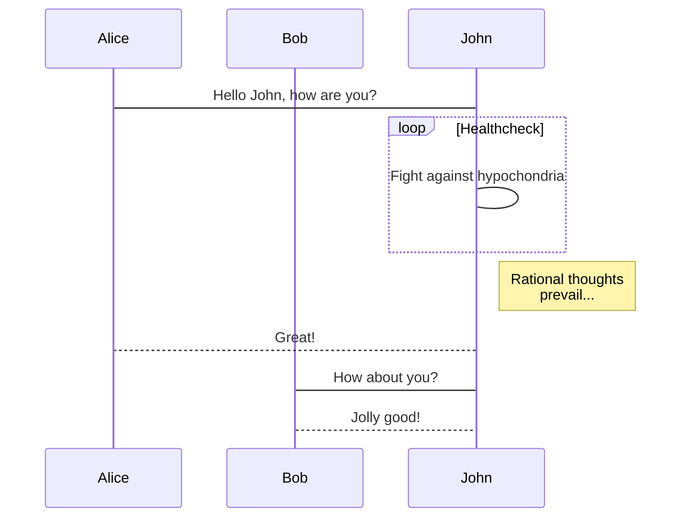
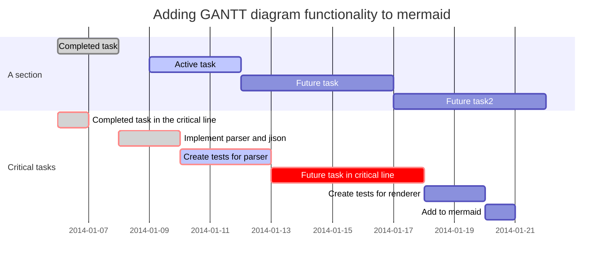

# markdown diagrams renderer

这是一个chrome浏览器插件，用于渲染github markdown中的时序图、流程图。

This is an extensions for chrome browser, which is used to render diagrams in markdown. Now it support sequence chart, flowchart.

## Usage

1. Install this extension by developer mode.
2. Click icon, then click `点击渲染` button.


## TODO

- [x] support auto-render
- [x] support fullscreen
- [x] <del>support change background</del>
- [x] support download image
- [ ] support mermaid
- [x] change to customized [icon](https://www.flaticon.com)
- [ ] upload to chrome webstore

## Example
### sequence
    ```sequence
    Title: Here is a title
    A->B: Normal line
    B-->C: Dashed line
    C->>D: Open arrow
    D-->>A: Dashed open arrow
    ```


```sequence
Title: Here is a title
A->B: Normal line
B-->C: Dashed line
C->>D: Open arrow
D-->>A: Dashed open arrow
```

### flowchart

    ```flow
    st=>start: Start:>http://www.google.com[blank]
    e=>end:>http://www.google.com
    op1=>operation: My Operation
    sub1=>subroutine: My Subroutine
    cond=>condition: Yes
    or No?:>http://www.google.com
    io=>inputoutput: catch something...

    st->op1->cond
    cond(yes)->io->e
    cond(no)->sub1(right)->op1
    ```


```flow
st=>start: Start:>http://www.google.com[blank]
e=>end:>http://www.google.com
op1=>operation: My Operation
sub1=>subroutine: My Subroutine
cond=>condition: Yes
or No?:>http://www.google.com
io=>inputoutput: catch something...

st->op1->cond
cond(yes)->io->e
cond(no)->sub1(right)->op1
```

### mermaid






## License
MIT